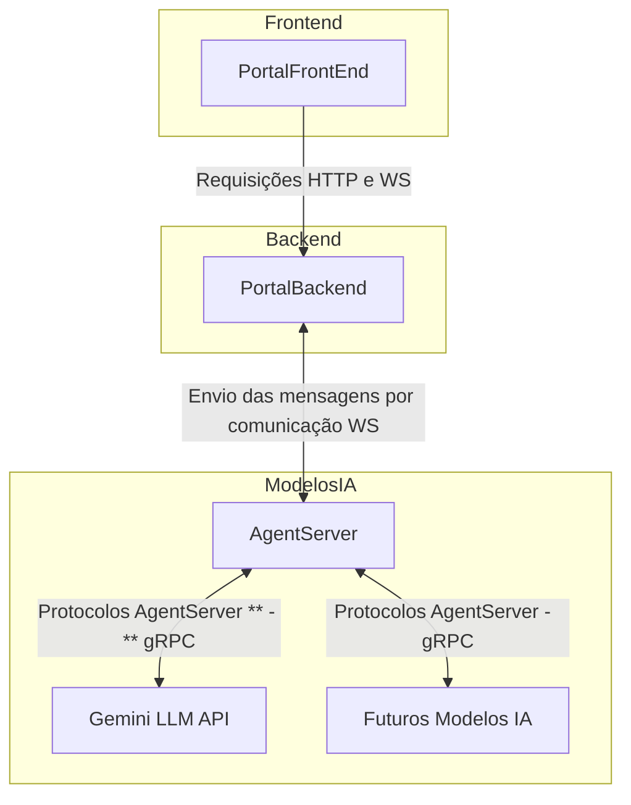

# AgentServer

```mermaid
graph TD
    subgraph Frontend
        PFE[PortalFrontEnd]
    end

    subgraph Backend
        PBE[PortalBackend]
    end
    
    subgraph   ModelosIA
        GEM[Gemini LLM API]
        FUT[Futuros Modelos IA]
        AgentServer
    end


    %% Conexões Frontend
    PFE -->|Requisições HTTP e WS | PBE

    
    %% Conexões Backend
    PBE<-->|Envio das mensagens por comunicação WS| AgentServer
    
    %% Conexões AgentServer
    AgentServer <-->|Protocolos AgentServer ** - ** gRPC | GEM
    AgentServer <-->|Protocolos AgentServer -  gRPC| FUT

    class PFE,Chat frontend
    class PBE,AgentServer,Auth backend
    class V4D,V4F vision
    class GEM,FUT ia
    class CTX,LOGS db
```

