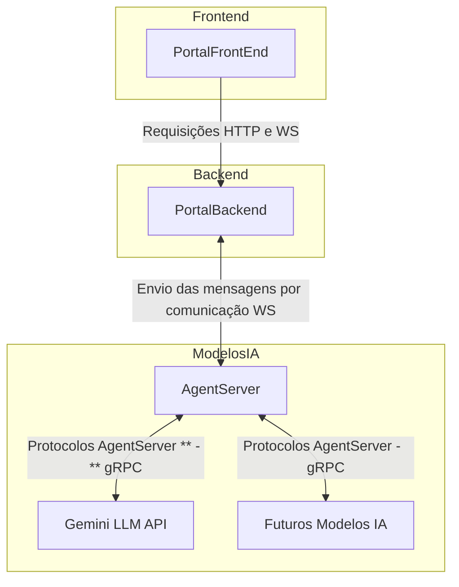

# AgentServer

`AgentServer` atua como um orquestrador de agentes de `IA` especializados. A aplicação recebe mensagens de usuários via chatbot e, com base na intenção identificada, direciona a requisição para o agente mais adequado para executar a tarefa solicitada.

Utilizando a Gemini API como motor de orquestração, o sistema toma decisões sobre qual agente especializado deve processar cada tipo de solicitação. 

A arquitetura foi projetada para ser flexível e escalável, permitindo a fácil adição de novos agentes com diferentes especializações conforme necessário.

> Agentes disponíveis: 

- `DocAgent`: Especialista em analisar código fonte e gerar documentações em tempo real como fluxo de trabalho, diagramas de relacionamento entre tabelas e diagramas de classe.

