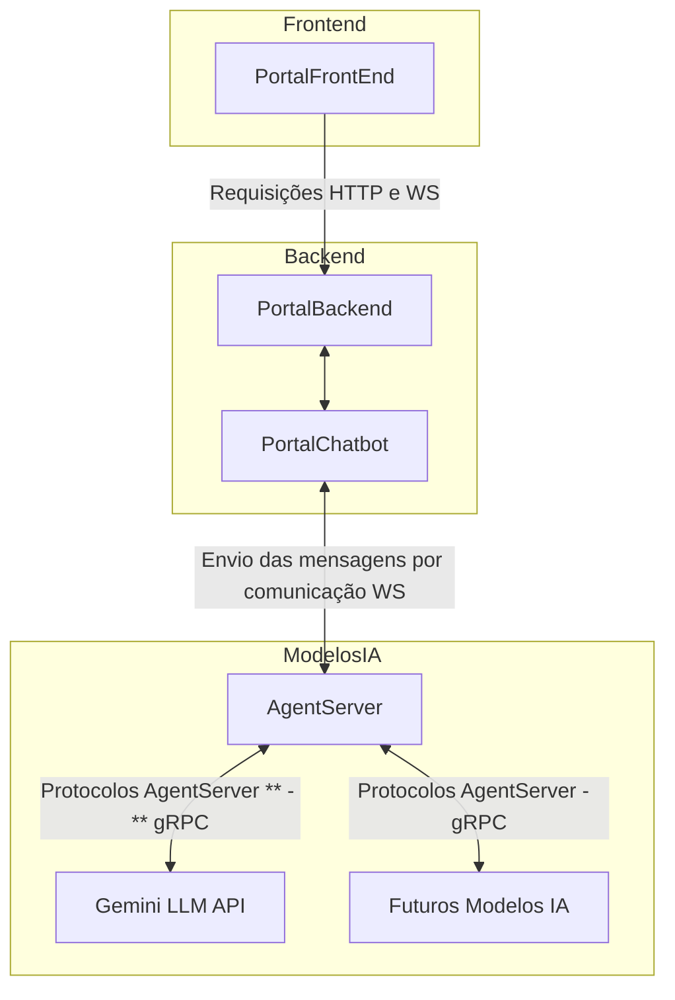

# Viabilidade do `AgentServer Server` integrado ao `PortalBackEnd`

### Problemas encontrados

- Autenticar usuários e controlar acesso ao PortalChatbot

- Porque usar um `AgentServer Server`? e Integração com os demais serviços.

### Soluções que um `AgentServer Server` oferece

1. Centralizar e orquestrar comunicação entre o DocAgent e demais agentes.

2. Gestão de estados e contextos enviados a `LLM`

3. Autenticação unificada e feita antes da interação com o `AgentServer Server`

- redesenhar diagrama das aplicações.

